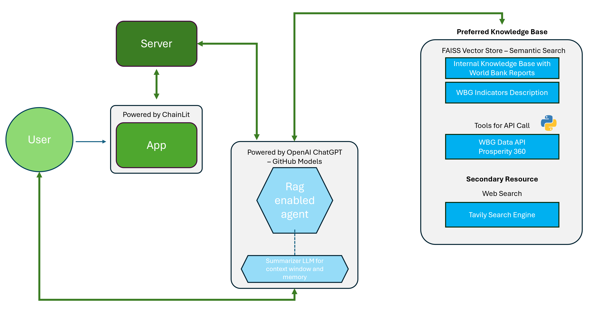

# StartKenya Endeleza AI Business Advisor

*Submission for the Microsoft AI Agents Hackathon*

---

## 🎯 Overview

**StartKenya** is an AI agent designed to help young entrepreneurs in Kenya turn complex data into clear, actionable insights. By seamlessly integrating internal World Bank datasets, local PDF resources, and internet search, our agent empowers users to:

- Unlock new market opportunities  
- Navigate regulations and formalization steps  
- Discover funding sources and key indicators  

> _“An AI Agent for young entrepreneurs—transforming complex data into clear, actionable insights to unlock new opportunities.”_

---
## 🎥 Demo & Pitch Deck

- **Video demo**: [Watch here](<VIDEO_LINK>)  
- **Pitch deck**: [View here](<PITCH_DECK_LINK>)  
---

## 🌍 Our Mission

We come from diverse teams across the World Bank Group, united by a belief that innovation must directly support the mission of ending poverty on a livable planet.  
Entrepreneurs—especially in low-income urban areas—often lack easy access to trusted, localized information. World Bank data holds the answers, but it’s buried under complexity. StartKenya changes that by making data simple, fast, and actionable.

---

## 🚀 Why We Built This

- **Pain point**: Starting a business is hard without localized insights.  
- **Opportunity**: Vector‐search and RAG unlock World Bank data for real-time queries.  
- **Hackathon insight**: Time constraints drove us toward a single, elegant agent rather than multiple disconnected systems.  
- **Key breakthrough**: Using LangGraph for state management let one agent maintain context while calling different functions.

> “We thought we’d build separate agents for web search, API queries, and summarization. But with the right prompts, one smart agent does it all!”

---

## 🧠 Agentic Framework

Our agent doesn’t just wait for exact instructions—it autonomously:

1. Chooses **semantic_search** on internal PDFs  
2. Calls **wb_api_query_with_semantic_search** to find the right indicators  
3. Executes **query_data** to fetch World Bank time-series  
4. Falls back to **web_search** for general info  

This autonomy makes it feel like a human assistant—flexible, proactive, and action-oriented.

Note: Base URL for World Bank's API calls might change given continous updates.
URL used for this project: 
```
BASE_WB_URL=https://datacatalogapi.worldbank.org/dexapps/efi/data
```
Latest URL:
```
https://data360api.worldbank.org/data360/
```
---

## 📈 Architecture & Flow



1. **User query** →  
2. **RAG prompt** + **system prompt** →  
3. **Function‐calling** (semantic, API, web) →  
4. **Final answer** streaming back to the UI  

---

## 🖼️ Screenshots

  


---

## ⚙️ Installation & Usage

1. **Clone the repo**  
   ```
   git clone https://github.com/your-org/startkenya-agent.git
   cd startkenya-agent
   ```
2. **Create environment and install dependencies**  
   ```
   python -m venv venv
   source venv/bin/activate
   pip install -r requirements.txt
   ```

3. **Configure .env file**

   ```
   GITHUB_TOKEN=your_github_token
   WB_API_BASE_URL=https://datacatalogapi.worldbank.org/dexapps/efi/data
   ```

4. **Run the app**

   ```
   chainlit run cl_app.py
   ```

5. **Chat at http://localhost:8000**


## 🌱 Future Goals
Extend to other countries and datasets

- Add user personalization and saved workspaces

- Integrate more exponential technologies (blockchain, IoT)

- Enable on-demand expertise for sustainable, well-paying local careers

>_“Striving towards the dream of a world free from poverty on a livable planet, made accessible to individuals at a practical level.”_
